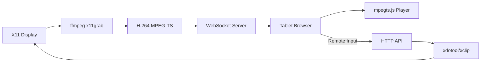

# 🖥️ Screen Stream

**Turn your tablet or phone into a high-performance second monitor for your Linux laptop.**

Stream your desktop and external monitors directly to any web browser on your local network. No app installation required on the client side—just open a URL or scan a QR code.


---

## ✨ Features

- 🚀 **Low Latency:** Optimized pipeline using `ffmpeg` and `mpegts.js` for sub-500ms latency.
- 🎮 **Interactive Remote Control:** Use your tablet's touch screen to move the mouse, click, scroll, and type on your laptop.
- 📋 **Clipboard Sync:** Effortlessly share text between your tablet and laptop.
- ⚡ **Hardware Accelerated:** Automatically detects and uses **NVENC** (NVIDIA) or **VAAPI** (AMD/Intel) for ultra-efficient encoding.
- 📱 **Multi-Monitor Support:** Stream your laptop screen, external monitor, or both side-by-side.
- 📡 **Zero Configuration:** mDNS/Zeroconf support (`http://screen-stream.local:8766`) and terminal QR codes for instant access.
- 🔍 **Smart Zoom & Pan:** Pinch-to-zoom and swipe gestures optimized for mobile browsers.
- 🔴 **Cursor Highlighting:** Real-time visual feedback of your laptop's cursor position on the tablet.

---

## 🛠️ How It Works



---

## 🚀 Quick Start

### 1. Prerequisites
Ensure you have `ffmpeg` and `python3` installed. For interactive features (remote control/clipboard), install `xdotool` and `xclip`.

```bash
sudo apt update
sudo apt install ffmpeg xdotool xclip python3-venv
```

### 2. Run the Server
Clone this repository and run the startup script:

```bash
git clone https://github.com/krsatyam36/screenshare.git
cd screenshare
./start.sh
```

The script will automatically set up a virtual environment and install necessary Python packages.

### 3. Connect
Open the URL printed in your terminal (e.g., `http://192.168.1.10:8766`) on your tablet's browser. If you have `qrcode` installed, you can just scan the QR code printed in the terminal.

---

## 📦 Installation Options

### As a System Command
You can link the `screenshare` wrapper to your path:
```bash
sudo ln -sf $(pwd)/screenshare /usr/local/bin/screenshare
```
Now you can start streaming by simply typing `screenshare` from any directory.

### Debian/Ubuntu (.deb)
A pre-built package is available for easier installation:
```bash
sudo dpkg -i screen-share-tab_1.0.0_amd64.deb
```

---

## ⚙️ Configuration

The tool is configured to detect two screens by default. If your layout is different, you can customize the `SCREENS` and `SCREEN_BOUNDS` dictionaries in `server.py`:

```python
SCREENS = {
    'laptop':   {'size': '1920x1080', 'offset': '0,1080'},
    'external': {'size': '1920x1080', 'offset': '0,0'},
}
```
*Tip: Run `xrandr` in your terminal to see your exact screen dimensions and offsets.*

---

## ⌨️ Browser Shortcuts

| Key | Action |
|:---:|---|
| `1` / `2` | Switch to Laptop / External monitor |
| `B` | View both monitors side-by-side |
| `F` | Toggle Fullscreen |
| `←` / `→` | Swipe/Switch between screens |
| `↑` / `↓` | Adjust FPS |
| `L` / `M` / `H` | Quality: Low (600k), Medium (1.5M), High (3M) |
| `C` | Toggle Cursor Highlight |

---

## 🛡️ Security & Ports

The tool uses two ports:
- **8765**: WebSocket (Video Data)
- **8766**: HTTP (Web Interface & Remote Input)

Ensure these are allowed through your firewall:
```bash
sudo ufw allow 8765/tcp
sudo ufw allow 8766/tcp
```

*Note: This tool is intended for use on trusted local networks. It does not include built-in authentication.*

---

## 🤝 Contributing

Contributions are welcome! Feel free to open an issue or submit a pull request.

---

## 👤 Author

**Kumar Satyam**
- 📧 Email: [kumarsatyam3135@gmail.com](mailto:kumarsatyam3135@gmail.com)
- 🐙 GitHub: [@your-username](https://github.com/krsatyam36)

---

## 📄 License

This project is licensed under the MIT License - see the [LICENSE](LICENSE) file for details.

