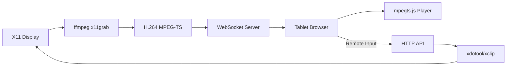

# 🖥️ Screen Stream

**Turn your tablet or phone into a high-performance second monitor for your Linux laptop.**

Stream your desktop and external monitors directly to any web browser on your local network. No app installation required on the client side—just open a URL or scan a QR code.


---

## ✨ Features

**Full remote control (new in v1.1.0):**

- ⌨️ **Reliable Mobile Typing:** Robust soft-keyboard capture (input/composition events) — works with Android keyboards, swipe-typing, and autocorrect, not just hardware keys.
- 🎮 **Interactive Remote Control:** Use your tablet's touch screen to move the mouse, click, scroll, and type on your laptop.
- 🖱️ **Touchpad Mode:** Relative pointer mode — drag to move the cursor like a laptop trackpad for precise control, alongside the default tap-to-position mode.
- 🔊 **Audio Forwarding:** Stream your laptop's sound to the tablet (AAC muxed into the video — no extra setup on the client).
- 🚀 **App Launcher & System Controls:** Browse installed apps and launch them; adjust volume, mute, media keys, lock, or suspend — all from the tablet.
- 📁 **File Transfer:** Browse your home folder, download files to the tablet, and upload from it.
- `>_` **Web Terminal:** A full `xterm.js` terminal in the browser, backed by a real PTY on the laptop.
- 🔒 **Secure by Default:** Every launch requires a PIN and is encrypted over self-signed TLS (`https`/`wss`) — one secured front door to the whole app.

**Streaming core:**

- 🚀 **Low Latency:** Optimized pipeline using `ffmpeg` and `mpegts.js` for sub-500ms latency.
- ⚡ **Hardware Accelerated:** Automatically detects and uses **NVENC** (NVIDIA) or **VAAPI** (AMD/Intel) for ultra-efficient encoding.
- 📱 **Multi-Monitor Support:** Stream your laptop screen, external monitor, or both side-by-side.
- 📋 **Clipboard Sync:** Effortlessly share text between your tablet and laptop.
- 📡 **Zero Configuration:** mDNS/Zeroconf support (`https://screen-stream.local:8766`) and terminal QR codes for instant access.
- 🔍 **Smart Zoom & Pan:** Pinch-to-zoom and swipe gestures optimized for mobile browsers.
- 🔴 **Cursor Highlighting:** Real-time visual feedback of your laptop's cursor position on the tablet.
- 🔋 **At-a-glance status:** Live RTT, laptop battery, and auto-quality that adapts the bitrate to your network.

---

## 🛠️ How It Works



---

## 🚀 Quick Start

### 1. Prerequisites
Ensure you have `ffmpeg` and `python3` installed. For interactive features (remote control/clipboard), install `xdotool` and `xclip`.

```bash
sudo apt update
sudo apt install ffmpeg xdotool xclip python3-venv
```

**Optional extras** (each unlocks a feature; the UI hides what isn't installed):

```bash
# App launcher + system controls (most desktops already have these)
sudo apt install libglib2.0-bin            # gtk-launch / gapplication
# Volume/mute control needs wpctl (PipeWire) — usually preinstalled on modern distros
# Lock/suspend uses loginctl/systemctl (systemd) — preinstalled
# Self-signed TLS needs openssl                — usually preinstalled
```

Audio forwarding works out of the box on **PipeWire** (with `wpctl`) or **PulseAudio**. The web terminal and file transfer need no extra packages. `xterm.js` is fetched automatically by `start.sh` on first run.

### 2. Install the `screenshare` command
Clone the repo, then put the launcher on your `PATH` so you can start it from any terminal. Pick one:

```bash
git clone https://github.com/krsatyam36/screenshare.git
cd screenshare

# Option A — system-wide (needs sudo)
sudo ln -sf "$(pwd)/screenshare" /usr/local/bin/screenshare

# Option B — no sudo (per-user; make sure ~/.local/bin is on your PATH)
mkdir -p ~/.local/bin && ln -sf "$(pwd)/screenshare" ~/.local/bin/screenshare
```

> Prefer not to install at all? Just run `./start.sh` from the repo — it's the same launcher.

### 3. Run it — one command, secured by default

```bash
screenshare
```

That's it. The **first run** sets up the Python virtual environment and downloads `mpegts.js` (video player) + `xterm.js` (web terminal) — so the first launch needs internet, and the **web terminal won't appear until `xterm.js` has been fetched**. The server then starts with **a PIN and TLS already on** (see [Security](#-security-always-on)). Every feature — screen + audio, remote control, touchpad mode, app launcher, system controls, file transfer, and the web terminal — comes up together; there are no separate commands to run.

### 4. Connect
Open the **`https://`** URL printed in your terminal (e.g. `https://192.168.1.10:8766`) on your tablet — or scan the QR code. Accept the self-signed-certificate warning once, then **enter the PIN shown in the terminal**. You're in.

---

## 📦 Installation Options

### As a System Command
Use one of the two `ln -sf` options from step 2 (system-wide with sudo, or per-user in `~/.local/bin`), then type `screenshare` from any directory. To run without installing, use `./start.sh` from the repo.

### Debian/Ubuntu (.deb)
Build a package from source (version comes from the argument):
```bash
./packaging/build-deb.sh 1.1.0
sudo apt install ./screen-share-tab_1.1.0_amd64.deb
```
The package installs the same secure-by-default server and exposes the `screen-share-tab` command. *(The pre-built `.deb` distributed for v1.0.0 predates the v1.1.0 features — rebuild from source for the latest.)*

---

## ⚙️ Configuration

The tool is configured to detect two screens by default. If your layout is different, you can customize the `SCREENS` and `SCREEN_BOUNDS` dictionaries in `server.py`:

```python
SCREENS = {
    'laptop':   {'size': '1920x1080', 'offset': '0,1080'},
    'external': {'size': '1920x1080', 'offset': '0,0'},
}
```
*Tip: Run `xrandr` in your terminal to see your exact screen dimensions and offsets.*

---

## ⌨️ Browser Shortcuts

| Key | Action |
|:---:|---|
| `1` / `2` | Switch to Laptop / External monitor |
| `B` | View both monitors side-by-side |
| `F` | Toggle Fullscreen |
| `←` / `→` | Swipe/Switch between screens |
| `↑` / `↓` | Adjust FPS |
| `L` / `M` / `H` | Quality: Low (600k), Medium (1.5M), High (3M) |
| `C` | Toggle Cursor Highlight |
| `R` | Toggle Remote Control mode |
| `K` | Toggle on-screen Keyboard |

The v1.1.0 controls are touch-first and live on the toolbar (a tablet rarely has a hardware keyboard):

| Toolbar button | Action |
|:---:|---|
| 🎮 Control | Remote mouse/keyboard control |
| 🖱 Pad | Touchpad (relative) pointer mode |
| ⌨ KB | Show the on-screen keyboard bar |
| 🔊 Audio | Forward laptop audio to the tablet |
| ☰ Apps | App launcher + system controls (volume, lock, media…) |
| 📁 Files | Browse / upload / download files |
| `>_` Term | Open the web terminal |
| 📶 Auto | Auto-adjust quality to the network |
| 📋 Clip | Clipboard sync |

---

## 🔒 Security (always on)

Because Screen Stream gives full remote control of your laptop — keyboard, mouse, a web terminal, and file access — **it locks itself down by default**. There is one secured front door to *everything*:

- **PIN login** — a login page guards the whole app. A signed session cookie then authorizes both the web UI (HTTP) and the video/terminal sockets (WebSocket).
- **TLS encryption** — all traffic is served over `https://` + `wss://` using a self-signed certificate generated on first run.

### The PIN

A random 4-digit PIN is generated the first time you run `screenshare` and stored in `~/.config/screen-stream/pin`. It's printed in the startup banner every launch:

```
  Auth        →  PIN 2681   · enter this on the tablet
```

Read it off the laptop and type it on the tablet. To change it:

```bash
screenshare --pin 1234     # sets and remembers a new PIN
```

### Connecting (self-signed cert)

The first time you open `https://<ip>:8766`, your browser warns about the self-signed certificate — accept it once. **You may also need to accept it once for the WebSocket** at `https://<ip>:8765` (open that URL directly and approve) so the video stream can connect.

### Ports & firewall

| Port | Purpose |
|---|---|
| **8765** | WebSocket — video/audio stream + terminal |
| **8766** | HTTPS — web interface, remote input, files |

```bash
sudo ufw allow 8765/tcp
sudo ufw allow 8766/tcp
```

### Local debugging escape hatch

If you're testing on the laptop itself and want to skip security, the flags still exist:

```bash
screenshare --no-tls --no-pin     # plain http://, no login (trusted LAN only)
screenshare --tls --cert /path/cert.pem --key /path/key.pem   # bring your own cert
```

> Anyone with the PIN effectively has a shell on your laptop — keep it to yourself.

---

## 🤝 Contributing

Contributions are welcome! Feel free to open an issue or submit a pull request.

---

## 👤 Author

**Kumar Satyam**
- 📧 Email: [kumarsatyam3135@gmail.com](mailto:kumarsatyam3135@gmail.com)
- 🐙 GitHub: [@krsatyam36](https://github.com/krsatyam36)

---

## 📄 License

This project is licensed under the MIT License - see the [LICENSE](LICENSE) file for details.

