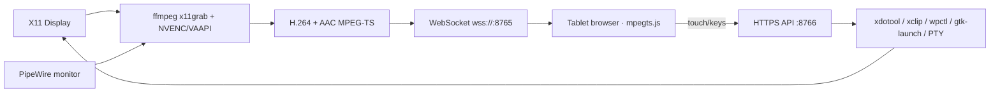

<div align="center">

# 🖥️ Screen Stream

**v2.0.0** — *Turn a tablet or phone into a full, secure remote desktop for your Linux laptop: live screen + audio, keyboard & touchpad control, an app launcher, file transfer and a web terminal — over your LAN, with no app to install on the client.*

[](https://github.com/krsatyam36/screenshare)
[](https://kernel.org)
[](https://python.org)
[](https://ffmpeg.org)
[](#-security-always-on)
[](https://opensource.org/licenses/MIT)

**Leave the laptop at home. Run it entirely from the roof.**

</div>

---

## Table of Contents

- [Overview](#overview)
- [Features](#features)
- [Prerequisites](#prerequisites)
- [Install & Run](#install--run)
  - [1. Clone](#1-clone)
  - [2. Install the `screenshare` command](#2-install-the-screenshare-command)
  - [3. Run it](#3-run-it)
  - [4. Install the desktop app (optional)](#4-install-the-desktop-app-optional)
  - [5. Connect from the tablet](#5-connect-from-the-tablet)
- [🔒 Security (always on)](#-security-always-on)
- [Controls](#controls)
- [How It Works](#how-it-works)
- [Project Structure](#project-structure)
- [Packaging](#packaging)
- [Troubleshooting](#troubleshooting)
- [Author & License](#author--license)

---

## Overview

Screen Stream captures your X11 display with `ffmpeg` (hardware-accelerated via **NVENC**/**VAAPI** when available), muxes H.264 video + AAC audio into an MPEG-TS stream, and delivers it over a WebSocket to any modern browser, where `mpegts.js` plays it with sub-500 ms latency. A small HTTP API turns your touches into real mouse/keyboard events (`xdotool`), and adds an app launcher, system controls, a `$HOME`-jailed file browser and a PTY-backed web terminal.

Everything is **secured by default**: a per-launch PIN guards the whole app and traffic is encrypted over TLS.

---

## Features

**Full remote control:**

- ⌨️ **Reliable mobile typing** — soft-keyboard capture via `input`/composition events; works with Android keyboards, swipe-typing and autocorrect.
- 🎮 **Mouse & touch control** — tap to click, hold for right-click, drag to select.
- 🖱️ **Touchpad mode** — relative pointer motion like a laptop trackpad, for precision.
- 🔍 **Pinch-zoom & pan everywhere** — pinch to zoom in any mode; drag with two fingers to pan around the zoomed frame.
- 🖲️ **Universal two-finger scroll** — two fingers scroll like a mouse wheel (on the stream and in the terminal).
- 🔊 **Audio forwarding** — laptop sound streamed to the tablet (AAC muxed into the video).
- 🚀 **App launcher & system controls** — real app icons, tap to launch; volume/mute, media keys, lock, suspend.
- 📁 **File transfer** — browse `$HOME`, download to the tablet, upload from it.
- `>_` **Web terminal** — a real PTY behind `xterm.js`, with live resize and touch scroll.

**Streaming core:**

- ⚡ **Hardware-accelerated** H.264 (NVENC / VAAPI) with automatic detection.
- 📱 **Multi-monitor** — laptop, external, or both side-by-side.
- 📋 **Clipboard sync** between laptop and tablet.
- 📡 **Zero-config discovery** — mDNS (`screen-stream.local`) + terminal QR code.
- 🔋 **Live status** — RTT, laptop battery, and auto-quality that adapts bitrate to the network.

**Secure by default:** PIN login + self-signed TLS (`https`/`wss`) — one front door to everything.

---

## Prerequisites

```bash
sudo apt update
sudo apt install ffmpeg xdotool xclip python3-venv
```

Optional extras (each unlocks a feature; the UI hides what isn't present):

| Tool | Enables |
|---|---|
| `libglib2.0-bin` (`gtk-launch`) | App launcher |
| `wpctl` (PipeWire) / PulseAudio | Audio forwarding, volume/mute |
| `loginctl` / `systemctl` (systemd) | Lock / suspend |
| `openssl` | Self-signed TLS (usually preinstalled) |

`mpegts.js` and `xterm.js` are fetched automatically on first run (needs internet once).

---

## Install & Run

### 1. Clone

```bash
git clone https://github.com/krsatyam36/screenshare.git
cd screenshare
```

### 2. Install the `screenshare` command

Put the launcher on your `PATH` so you can start it from any terminal — pick one:

```bash
# Option A — system-wide (needs sudo)
sudo ln -sf "$(pwd)/screenshare" /usr/local/bin/screenshare

# Option B — no sudo (per-user; ensure ~/.local/bin is on your PATH)
mkdir -p ~/.local/bin && ln -sf "$(pwd)/screenshare" ~/.local/bin/screenshare
```

> Prefer not to install? Just run `./start.sh` from the repo — same launcher.

### 3. Run it

```bash
screenshare
```

First run sets up a virtualenv, downloads the browser assets, and starts the server **with a PIN and TLS already on**. Every feature comes up together — there are no per-feature commands.

### 4. Install the desktop app (optional)

```bash
./install-app.sh        # adds "Screen Stream" to your app grid (./install-app.sh remove to undo)
```

Opening **Screen Stream** from your launcher runs the server in a terminal window that shows the URL, QR code and the one-time PIN.

### 5. Connect from the tablet

Open the **`https://`** URL printed in the terminal (e.g. `https://192.168.1.10:8766`) — or scan the QR code. Accept the self-signed-certificate warning once, then **enter the PIN shown in the terminal**.

---

## 🔒 Security (always on)

Screen Stream grants full control of your laptop — keyboard, mouse, a shell and file access — so it locks itself down by default. One secured front door covers **everything** (web UI and both WebSockets):

- **PIN login** — a login page; a signed session cookie then authorizes HTTP and WebSocket.
- **TLS encryption** — `https://` + `wss://` via a self-signed cert (with your LAN IP in its SAN) generated on first run.

### The PIN

A **fresh random alphanumeric PIN is generated on every launch** — held in memory, never written to disk, never committed — and printed in the banner:

```
  Auth        →  PIN <shown-here>   · enter this on the tablet
```

Because it rotates each run, there's nothing to leak. To pin a fixed value for a run:

```bash
screenshare --pin <your-pin>
```

### Accepting the certificate

Self-signed certs trigger a one-time browser warning on a LAN IP. Open `https://<ip>:8766`, accept it, and — if the video doesn't connect — open `https://<ip>:8765` once and accept it there too (that's the WebSocket port).

### Ports

| Port | Purpose |
|---|---|
| **8765** | WebSocket — video/audio stream + terminal |
| **8766** | HTTPS — web UI, remote input, files |

```bash
sudo ufw allow 8765/tcp && sudo ufw allow 8766/tcp
```

### Local-debug escape hatch

```bash
screenshare --no-tls --no-pin      # plain http://, no login (trusted LAN only)
screenshare --tls --cert cert.pem --key key.pem   # bring your own cert
```

> Anyone with the PIN effectively has a shell on your laptop — keep it to yourself.

---

## Controls

Toolbar buttons (touch-first):

| Button | Action |
|---|---|
| 🎮 Control | Remote mouse/keyboard control |
| 🖱 Pad | Touchpad (relative) pointer mode |
| ⌨ KB | On-screen keyboard bar |
| 🔊 Audio | Forward laptop audio |
| ☰ Apps | App launcher + system controls |
| 📁 Files | Browse / upload / download |
| `>_` Term | Web terminal |
| 📶 Auto | Adaptive quality |
| 📋 Clip | Clipboard sync |

Gestures: **pinch** to zoom (any mode) · **two-finger drag** to pan when zoomed · **two-finger up/down** to scroll like a wheel.

Keyboard shortcuts: `1`/`2` laptop/external · `B` both · `F` fullscreen · `←`/`→` switch · `↑`/`↓` FPS · `L`/`M`/`H` quality · `C` cursor · `R` control · `K` keyboard.

---

## How It Works



---

## Project Structure

```
screenshare/
├── screenshare              # launcher wrapper → start.sh
├── start.sh                 # sets up venv + assets, generates PIN, launches the server
├── install-app.sh           # installs the desktop app + icon
├── assets/screenshare.svg   # app logo
├── packaging/               # Debian .deb build
└── src/screenshare/         # the Python package
    ├── __main__.py          # python -m screenshare
    ├── server.py            # entry: wires modules, banner, runs HTTP + WS
    ├── config.py            # constants, paths, logging
    ├── security.py          # PIN auth, TLS, arg parsing
    ├── media.py             # encoders, audio capture, ffmpeg, streaming
    ├── host.py              # net/env, input, clipboard, apps, icons, battery
    ├── files.py             # $HOME-jailed file browser
    ├── terminal.py          # PTY web terminal
    ├── httpapp.py           # HTTP server + request handler
    ├── wsapp.py             # WebSocket routing + mDNS
    └── web/                 # index.html + mpegts.js + xterm.js (client)
```

---

## Packaging

Build a Debian package from source:

```bash
./packaging/build-deb.sh 2.0.0
sudo apt install ./screen-share-tab_2.0.0_amd64.deb
```

It installs the same secure-by-default server and exposes the `screen-share-tab` command.

---

## Troubleshooting

- **Browser says "not secure":** expected for a self-signed cert on a LAN IP — accept the warning once (see [Security](#-security-always-on)). The video lives on a second port (`:8765`); accept the cert there too if it won't connect.
- **Typing/control greyed out:** install `xdotool`. Clipboard needs `xclip`.
- **No audio:** needs PipeWire (`wpctl`) or PulseAudio; the 🔊 button is dimmed otherwise.
- **No web terminal:** `xterm.js` failed to download on first run — re-run `screenshare` with internet.
- **Wayland:** capture/control use X11; run under Xwayland for full functionality. Native Wayland is on the roadmap.

---

## Author & License

**Kumar Satyam** — [@krsatyam36](https://github.com/krsatyam36)

Licensed under the MIT License — see [LICENSE](LICENSE).
